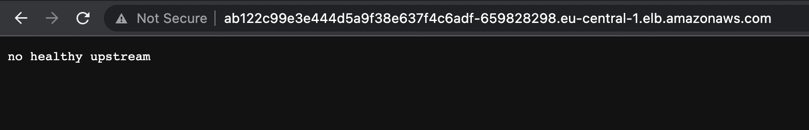
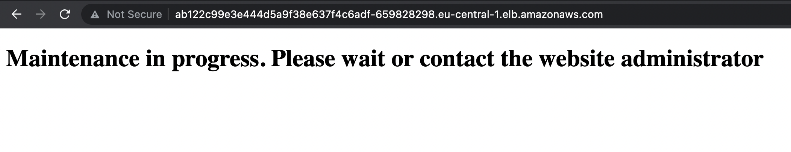

If the service is unavailable, Istio will return a "No healthy upstream error"

This envoy-filter will customize message.

So instead of default message:

You will see this:

You can paste any HTMl code to prettify returned page, this is just example how to implement customization.
